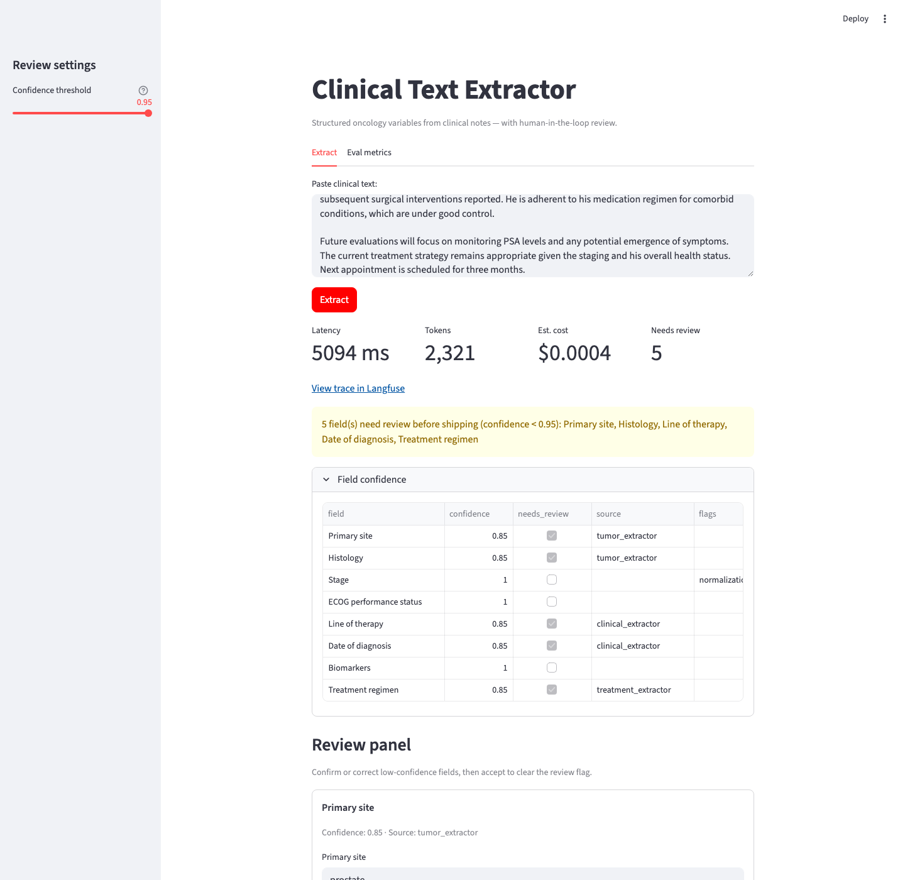
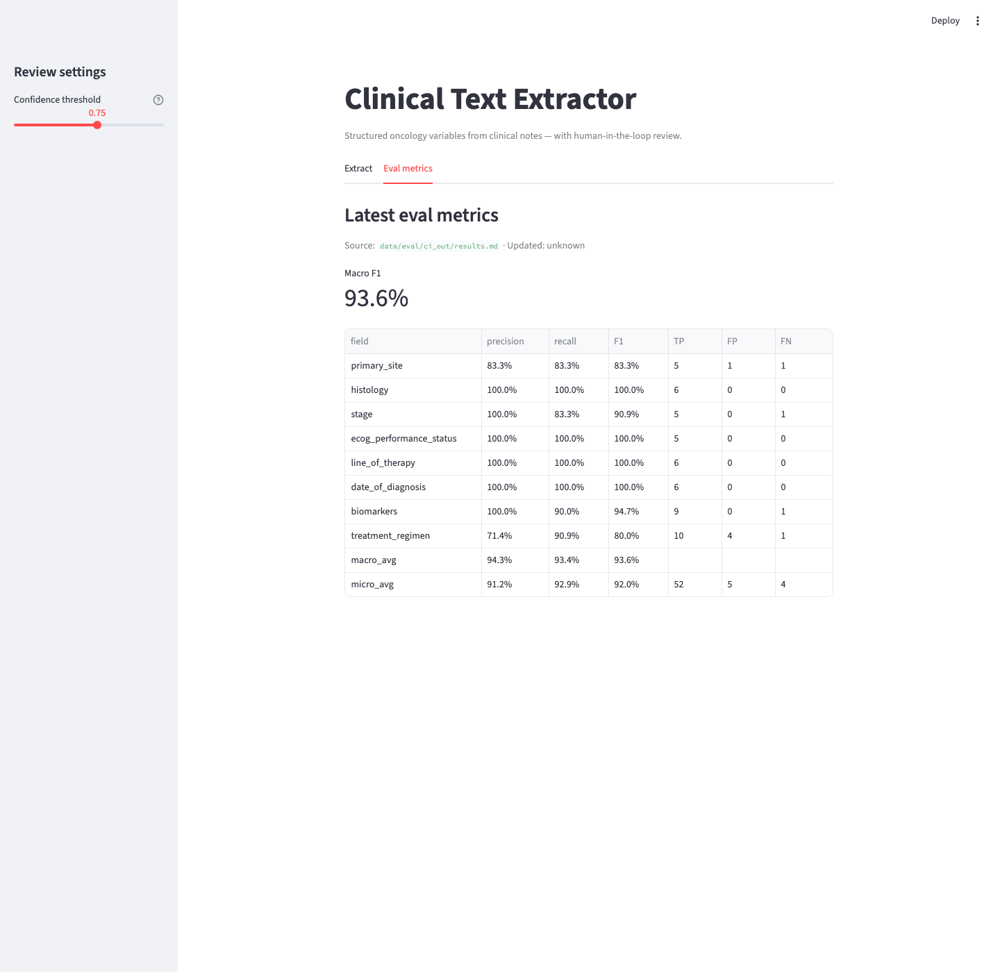
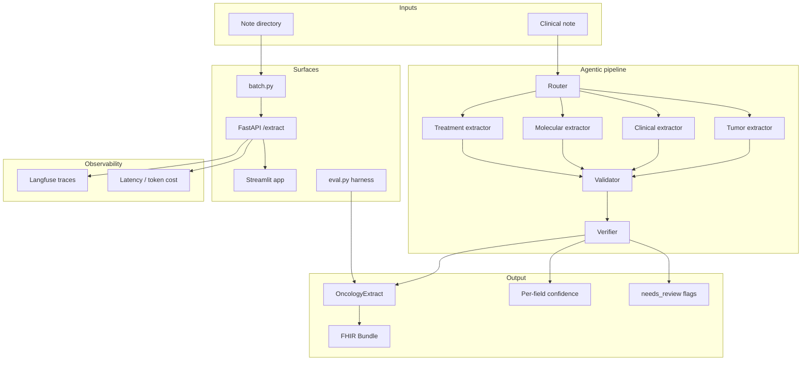

# ChartExtractor

[](https://github.com/armaangulati1/chartextract/actions/workflows/tests.yml)
[](https://github.com/armaangulati1/chartextract/actions/workflows/evals.yml)


ChartExtractor reads a doctor's free-text note about a cancer patient and turns it into a clean, structured data record — and when it isn't confident about a field, it flags it for a human to check instead of guessing.

**[▶ Try the live app](https://chartextract-f9wfrftqzygappf2pgi3hts.streamlit.app/)** · **[API docs](https://chartextract.onrender.com/docs)**



*The live review screen: the model extracted a structured record from a prostate-cancer note in ~5 seconds for $0.0004 — then flagged 5 fields it wasn't confident about and routed them to a human sign-off panel. It asks instead of guessing.*

## What this does

- Reads an unstructured clinical note and pulls out 8 key oncology facts: cancer site, tumor type, stage, performance status, biomarkers, diagnosis date, line of therapy, and treatment regimen
- Scores its own confidence on every field — anything below a threshold goes to a human review screen before it ships
- Grades itself against hand-labeled answer keys, field by field, and keeps an honest error ledger (what it hallucinated, missed, or got wrong)
- Automatically blocks any code change that drops accuracy below a set bar, before it can deploy
- Tracks the speed and dollar cost of every extraction
- Exports records in FHIR, the standard data format hospitals' systems speak

## Why it matters

Cancer care, clinical trials, and national cancer registries (like the NCI's [SEER program](https://seer.cancer.gov/)) all run on structured chart data — and today, most of it is produced by trained abstractors reading notes and keying in fields by hand: slow, expensive, and hard to audit. An AI that does this *and confidently guesses when it's wrong* is dangerous in healthcare. The point of this project is the harder part: measuring exactly where the model fails, field by field, and routing uncertainty to humans instead of shipping it.

## What the numbers mean (plain English)

The technical Impact bullets below, translated:

- **"93.6% macro-F1, gate at 85%"** — on its curated practice set (6 notes, 8 fields each), it gets roughly 94% of fields right, and an automated gate blocks any code change that would drop accuracy below 85%.
- **"250 gold-labeled notes; real-world 53.8%"** — it was tested against 250 hand-checked notes. On messy real hospital transcripts, accuracy drops to ~54%. That gap is measured and reported honestly — which is exactly what you'd want to know *before* trusting a system like this in production.
- **"stage F1 +33 pp"** — a smarter multi-step reading strategy took the hardest field (cancer stage) from two-in-three correct to perfect on the test set, in a controlled head-to-head experiment.
- **"Shipped live"** — it's not just code: there's a [live web app](https://chartextract-f9wfrftqzygappf2pgi3hts.streamlit.app/) and [API](https://chartextract.onrender.com/docs) you can click right now, with per-run cost and latency tracking built in.



*Built-in scoreboard: per-field precision/recall/F1 on the CI gold set, live in the app and regenerated by the eval harness.*

---

## For Engineers

Everything below is the full technical documentation — metrics, methodology, architecture, and limitations, unabridged.

Structured oncology variable extraction from clinical notes — with per-field evaluation, human-in-the-loop review, and production-oriented observability.

**Impact**

- **93.6% macro-F1** on a 6-note CI gold set (per-field precision/recall on 8 variables); automated gate blocks deploy below **85%**
- **250 gold-labeled notes** evaluated (200 synthetic + 50 real MTSamples); real-world macro-F1 **53.8%** (−39.8 pp vs synthetic) — surfaced before production
- Agentic pipeline + verifier improved **stage F1 +33 pp** vs single-pass (66.7% → 100%) in a controlled 4-config experiment
- Shipped live: [Streamlit UI](https://chartextract-f9wfrftqzygappf2pgi3hts.streamlit.app/) + [FastAPI backend](https://chartextract.onrender.com/docs) with confidence-based human review and Langfuse cost/latency tracing

**Links**

| Surface | URL |
|---|---|
| **Live app (Streamlit)** | https://chartextract-f9wfrftqzygappf2pgi3hts.streamlit.app/ |
| **API docs (FastAPI)** | https://chartextract.onrender.com/docs |
| API health | https://chartextract.onrender.com/health |
| Eval report | [`data/eval/results.md`](data/eval/results.md) |
| Repo | https://github.com/armaangulati1/chartextract |

## Problem

Oncology workflows depend on discrete chart variables (primary site, stage, biomarkers, line of therapy, regimen) buried in unstructured clinical text. Manual abstraction is slow, inconsistent, and hard to audit. ChartExtractor turns free-text notes into a typed `OncologyExtract` record, scores every field against gold labels, and routes low-confidence extractions to human review before they ship.

The hard part is not “call an LLM once” — it is **measuring per-field accuracy**, **catching normalization drift** (colon vs colorectal, FOLFIRI vs component drugs), and **knowing when not to trust the model** on real consult transcripts.

## Architecture



**Core modules**

| Module | Role |
|---|---|
| `schema.py` | `OncologyExtract` contract (8 fields + enums) |
| `pipeline.py` | Router → grouped extractors → validator → verifier |
| `extractor.py` | Public `extract()` entrypoint with Langfuse `@observe` |
| `eval.py` | Per-field P/R/F1, error taxonomy, CI macro-F1 gate |
| `batch.py` | Concurrent folder processing → JSONL + run summary |
| `app.py` | Streamlit UI: extract, review panel, eval dashboard |
| `fhir.py` | Optional `to_fhir()` → FHIR R4 Bundle |

## Results

All metrics below are in [`data/eval/results.md`](data/eval/results.md). Regenerate with:

```bash
python experiment.py                              # experiment section (config comparison)
python scripts/report_real_eval.py --use-cache    # dataset P/R/F1 + error taxonomy
```

Evaluations use a **6-note CI gold set** (`data/eval/ci_gold`) for CI gating, plus **50 hand-labeled MTSamples** transcriptions (`data/real/`). Dataset evals use the production path: `extract_record()` → pipeline + verifier (`gpt-4o-mini`).

### Synthetic — CI gold (6 notes)

| field | TP | FP | FN | precision | recall | F1 |
|---|---:|---:|---:|---:|---:|---:|
| primary_site | 5 | 1 | 1 | 83.3% | 83.3% | 83.3% |
| histology | 6 | 0 | 0 | 100.0% | 100.0% | 100.0% |
| stage | 5 | 0 | 1 | 100.0% | 83.3% | 90.9% |
| ecog_performance_status | 5 | 0 | 0 | 100.0% | 100.0% | 100.0% |
| line_of_therapy | 6 | 0 | 0 | 100.0% | 100.0% | 100.0% |
| date_of_diagnosis | 6 | 0 | 0 | 100.0% | 100.0% | 100.0% |
| biomarkers | 9 | 0 | 1 | 100.0% | 90.0% | 94.7% |
| treatment_regimen | 10 | 4 | 1 | 71.4% | 90.9% | 80.0% |
| **macro_avg** | | | | 94.3% | 93.4% | **93.6%** |
| micro_avg | 52 | 5 | 4 | 91.2% | 92.9% | 92.0% |

CI gate: macro-F1 ≥ **85%** (passes).

**Error taxonomy (synthetic)**

| error_type | count | share |
|---|---:|---:|
| hallucinated | 4 | 50.0% |
| wrong_value | 1 | 12.5% |
| missed | 3 | 37.5% |

### Real — MTSamples (50 notes)

| field | TP | FP | FN | precision | recall | F1 |
|---|---:|---:|---:|---:|---:|---:|
| primary_site | 17 | 21 | 29 | 44.7% | 37.0% | 40.5% |
| histology | 26 | 9 | 13 | 74.3% | 66.7% | 70.3% |
| stage | 3 | 1 | 2 | 75.0% | 60.0% | 66.7% |
| ecog_performance_status | 7 | 3 | 0 | 70.0% | 100.0% | 82.4% |
| line_of_therapy | 2 | 14 | 0 | 12.5% | 100.0% | 22.2% |
| date_of_diagnosis | 9 | 10 | 2 | 47.4% | 81.8% | 60.0% |
| biomarkers | 2 | 4 | 2 | 33.3% | 50.0% | 40.0% |
| treatment_regimen | 69 | 109 | 36 | 38.8% | 65.7% | 48.8% |
| **macro_avg** | | | | 49.5% | 70.1% | **53.8%** |
| micro_avg | 135 | 171 | 84 | 44.1% | 61.6% | 51.4% |

**Error taxonomy (real)**

| error_type | count | share |
|---|---:|---:|
| hallucinated | 136 | 60.7% |
| wrong_value | 32 | 14.3% |
| wrong_span | 6 | 2.7% |
| normalization | 1 | 0.4% |
| missed | 49 | 21.9% |

### Experiment: single-pass vs agentic pipeline

Per-field F1 on the same 6-note gold set (`data/eval/results.md`):

| field | single_pass_mini | pipeline_verifier_mini | Δ F1 (pp) |
|---|---:|---:|---:|
| primary_site | 100.0% | 83.3% | -16.7 |
| histology | 100.0% | 100.0% | +0.0 |
| stage | 66.7% | 100.0% | **+33.3** |
| ecog_performance_status | 100.0% | 100.0% | +0.0 |
| line_of_therapy | 100.0% | 100.0% | +0.0 |
| date_of_diagnosis | 100.0% | 100.0% | +0.0 |
| biomarkers | 100.0% | 94.7% | -5.3 |
| treatment_regimen | 100.0% | 80.0% | -20.0 |
| **macro_avg** | **95.8%** | **94.8%** | -1.1 |

| config | mode | model | verifier | macro-F1 |
|---|---|---|---:|---:|
| single_pass_mini | single_pass | gpt-4o-mini | n/a | 95.8% |
| pipeline_no_verifier_mini | pipeline | gpt-4o-mini | no | 92.7% |
| pipeline_verifier_mini | pipeline | gpt-4o-mini | yes | 94.8% |
| single_pass_4o | single_pass | gpt-4o | n/a | 100.0% |

**Verifier impact:** fixed 3 errors (mostly **stage** substage confusion) and introduced 7 (regimen splitting FOLFIRI → component drugs, dropped low-signal biomarkers like PSA, over-specific primary site).

### Synthetic vs real (summary)

| dataset | notes | macro-F1 | Δ vs synthetic |
|---|---:|---:|---:|
| synthetic (CI gold) | 6 | 93.6% | — |
| real (MTSamples) | 50 | **53.8%** | **-39.8 pp** |

Weakest real fields: **line_of_therapy** (22.2% F1), **biomarkers** (40.0%), **primary_site** (40.5%). On real notes, **hallucinated** errors dominate (60.7%) — mostly extracting values where gold is null.

## Run it

### Quick start (local)

```bash
git clone https://github.com/armaangulati1/chartextract.git && cd chartextract
cp .env.example .env   # set OPENAI_API_KEY; optional LANGFUSE_* / DATABASE_URL
pip install -r requirements.txt
uvicorn api:app --reload          # terminal 1 → http://localhost:8000
streamlit run app.py              # terminal 2 → http://localhost:8501
```

No API key handy? `pip install -r requirements-dev.txt && pytest` runs the full test suite (43 tests) offline against committed prediction caches.

The Streamlit app calls the API (`API_URL`, default `http://localhost:8000`). For the [live app](https://chartextract-f9wfrftqzygappf2pgi3hts.streamlit.app/), Streamlit Cloud is configured with `API_URL=https://chartextract.onrender.com`.

### One-command Docker (API)

```bash
docker build -t chartextract .
docker run --rm -p 8000:8000 --env-file .env chartextract
```

- **API:** http://localhost:8000  
- **Health:** http://localhost:8000/health  
- **Extract:** `POST /extract` with `{"text": "...", "review_threshold": 0.75}`

### Streamlit UI features

Per-run **latency, token cost, and Langfuse trace links**; **human review panel** for low-confidence fields; **eval metrics tab**; optional **FHIR Bundle** export.

### Batch throughput

```bash
python batch.py --input-dir data/synthetic --out-dir data/batch --workers 4
```

Writes `results.jsonl` + `run_summary.json` (throughput, p50/p95 latency, cost, % needs_review).

### Eval harness

```bash
pip install -r requirements-dev.txt
pytest
python eval.py --data-dir data/eval/ci_gold --min-macro-f1 0.85
python experiment.py                              # experiment section
python scripts/report_real_eval.py --use-cache    # full dataset metrics in results.md
```

### Deploy (Render + Streamlit Cloud)

**API** — Docker on Render ([`render.yaml`](render.yaml)). Required env: `OPENAI_API_KEY`, `DATABASE_URL`.

| Endpoint | URL |
|---|---|
| API (Swagger docs) | https://chartextract.onrender.com/docs |
| Health | https://chartextract.onrender.com/health |
| Extract | `POST https://chartextract.onrender.com/extract` |

**Streamlit** — [chartextract on Streamlit Cloud](https://chartextract-f9wfrftqzygappf2pgi3hts.streamlit.app/). Secrets: `API_URL=https://chartextract.onrender.com`.

## Limitations / what I'd do differently

1. **Synthetic ↔ real gap (-40 pp macro-F1).** The 6-note CI gate passes easily; 50 MTSamples notes expose that sparse consults break line-of-therapy and biomarker extraction. I'd expand real gold labeling before trusting production metrics.

2. **Regimen normalization.** The pipeline splits combo names (FOLFIRI) into component drugs, hurting treatment_regimen F1. I'd add a canonical regimen lexicon (like the drug synonym map in `eval.py`) at extraction time, not just at scoring time.

3. **Verifier threshold tuning.** The verifier fixes stage errors but drops PSA and hallucinates comorbidity meds (lisinopril). I'd gate verifier calls on validator flags only and raise the confidence floor for biomarker/list fields.

4. **Null-aware scoring.** Many real-note errors are "gold=null, model extracted something." Eval should report **abstention precision** separately from value accuracy so we can tune the router to skip sparse notes.

5. **Cost/latency at scale.** A full pipeline run is ~5–6 LLM calls per note (~6 s p50 on gpt-4o-mini). For high volume I'd cache router plans by note section headers, batch verifier calls, and default to single-pass with targeted re-extract on low-confidence fields only.

6. **FHIR is illustrative.** `to_fhir()` emits a valid R4 Bundle structure but uses text codes where LOINC/SNOMED mapping is incomplete. Production would need patient context, provenance, and terminology server validation.

---

*Metrics sourced from [`data/eval/results.md`](data/eval/results.md). Reproduce with `python experiment.py` and `python scripts/report_real_eval.py --use-cache`.*
