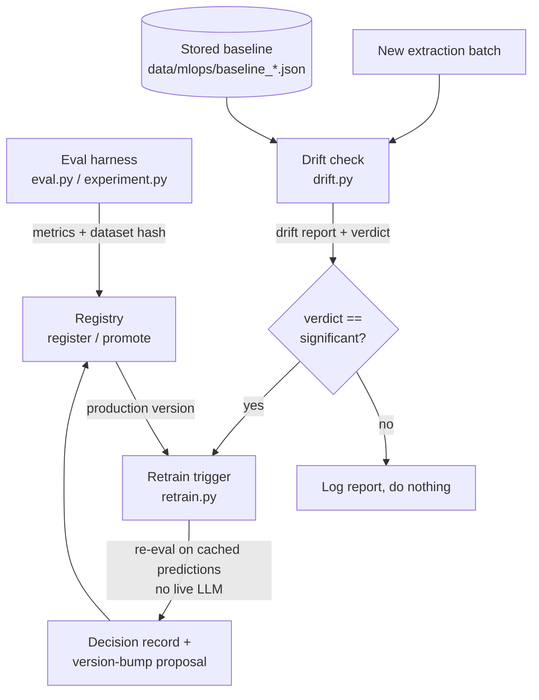

# MLOps loop: registry, drift check, retrain trigger

A small, honest monitoring loop wired onto the existing eval harness. It answers three
operational questions for a deployed LLM extraction service: which version is live and
how good was it, has the incoming data shifted away from what that version was validated
on, and when a shift is real, what should a human do about it.

Every number on this page comes from a run recorded under `data/mlops/evidence/`
(`evidence_run.txt`, `cli_transcript.txt`). No live LLM calls are made anywhere in this
loop; it reads recorded and synthetic extraction records already in the repo.

## What it does in 60 seconds

- **Registry** (`registry.py`): a versioned record of each model/prompt config, the eval
  metrics it scored, a hash of the dataset it was scored on, and a timestamp. You can
  register, list, compare, and promote a version to production.
- **Drift check** (`drift.py`): compares a new batch of extractor outputs against a stored
  baseline and reports per-field drift with a clear verdict (stable / moderate / significant).
- **Retrain trigger** (`retrain.py`): when drift is significant, it re-runs the eval on the
  promoted version and writes a "retrain recommended" decision plus a concrete prompt/model
  version-bump proposal into the registry.

## The loop



## What it does NOT do

- It does **not** train or fine-tune anything. This is an LLM extraction system with no
  trainable weights. "Retrain" here means: re-run the eval to get fresh metrics, then emit a
  prompt/model version-bump proposal for a human to act on. The word is kept because it is the
  industry term for this stage of the loop, but the honest mechanism is re-eval plus proposal.
- It does **not** call an LLM. The trigger re-evaluates over cached predictions
  (`use_cache=True`); a guard extractor raises if the cache ever misses rather than silently
  calling a model.
- It does **not** decide on its own to ship a new version. The output is a recommendation
  and a proposal written to the registry; promotion stays a human action.
- PSI is sample-size sensitive. Small current batches over a many-category field produce
  non-zero PSI from sampling noise alone (see the moderate verdict on the stable batch below).
  Treat "moderate" as watch, "significant" as act, and prefer batches of a few dozen or more.

## Field-level signals and thresholds

| signal | method | applies to |
|---|---|---|
| categorical distribution | PSI | primary_site, histology, stage, ecog, line_of_therapy |
| per-field presence rate | PSI | all eight schema fields (null-rate drift) |
| list length | two-sample KS | biomarker count, regimen length |
| confidence score | two-sample KS | per-field confidence, when the batch carries it |

PSI bands (industry standard): `< 0.10` stable, `0.10 to 0.25` moderate, `>= 0.25` significant.
KS: drift when the two-sample p-value `< 0.05` (default alpha). Both statistics are implemented
in the standard library because the repo does not depend on scipy; adding it to compute two
well-defined statistics would be a heavier dependency than the task warrants.

Confidence drift uses the same KS path as list length. The recorded prediction caches in this
repo predate per-field confidence logging, so the confidence row reads `n/a` on the evidence
run below; the unit test `test_confidence_ks_runs_when_present` exercises that path directly on
records that carry a `fields` confidence map.

## How to run each stage

Register the eval output as a version, then promote it:

```bash
python registry.py register \
  --label pipeline_verifier_mini --model gpt-4o-mini --mode pipeline \
  --metrics data/eval/latest_metrics.json --dataset data/eval/ci_gold
python registry.py promote v0001
python registry.py list
python registry.py compare v0002 v0001
```

Check a new batch against a stored baseline (build the baseline once, then compare):

```bash
# one-time: summarize a reference batch into a baseline profile
python drift.py --baseline data/synthetic --save-baseline data/mlops/baseline_synthetic.json
# each new batch:
python drift.py --baseline data/mlops/baseline_synthetic.json \
  --current data/mlops/evidence/current_drift.json --out data/mlops/drift_report.json
```

Run the drift-gated trigger (re-eval uses cached predictions, no live LLM):

```bash
python retrain.py --drift-report data/mlops/drift_report.json \
  --gold-dir data/eval/ci_gold --cache data/eval/ci_predictions.jsonl
```

## Evidence from the recorded run

Baseline: the 200 synthetic gold records in `data/synthetic`. Two current batches were built
from that same recorded data: a stable batch of 60 randomly sampled records, and a drifted
batch of 89 records filtered to primary_site in {lung, breast}.

**Stable batch (60 random records): verdict MODERATE, trigger did not fire.**
Top signals: histology PSI 0.2444, primary_site PSI 0.1272, stage PSI 0.1011; all continuous
KS stable. 0 significant, 3 moderate. The moderate flags are sampling noise from a 60-record
draw over a 9-category field, which is exactly why moderate does not trigger a retrain.

**Drifted batch (89 lung+breast records): verdict SIGNIFICANT, trigger fired.**

| field | method | score | verdict |
|---|---|---:|---|
| primary_site | PSI | 4.1953 | significant |
| histology | PSI | 2.8645 | significant |
| stage | PSI | 0.1700 | moderate |
| n_regimen | KS | 0.2469 | significant |

3 significant, 1 moderate. The trigger re-evaluated the promoted version `v0001` on the CI
gold set over cached predictions (no LLM) at macro-F1 **0.946970** across 6 examples, and wrote
a `retrain_recommended` decision to `v0001` proposing a prompt/model bump for the drifted fields
`[primary_site, histology, stage, n_regimen]`.

Registry state after the run: `v0001` (pipeline_verifier_mini, macro-F1 0.9476) promoted to
production; `v0002` (single_pass_mini, macro-F1 0.7845) registered. `compare v0002 v0001` shows
a macro-F1 delta of **+0.1631** on the same dataset hash.

## Files

| file | role |
|---|---|
| `registry.py` | versioned model/prompt registry (register, list, compare, promote, decisions) |
| `drift.py` | PSI + KS drift check, per-field report and verdict |
| `retrain.py` | drift-gated re-eval trigger and version-bump proposal |
| `data/mlops/registry.json` | the registry store |
| `data/mlops/baseline_synthetic.json` | stored baseline profile |
| `data/mlops/drift_report.json` | latest drift report |
| `data/mlops/evidence/` | raw run output backing every number above |
| `test_registry.py`, `test_drift.py`, `test_retrain.py` | tests for all three stages |
